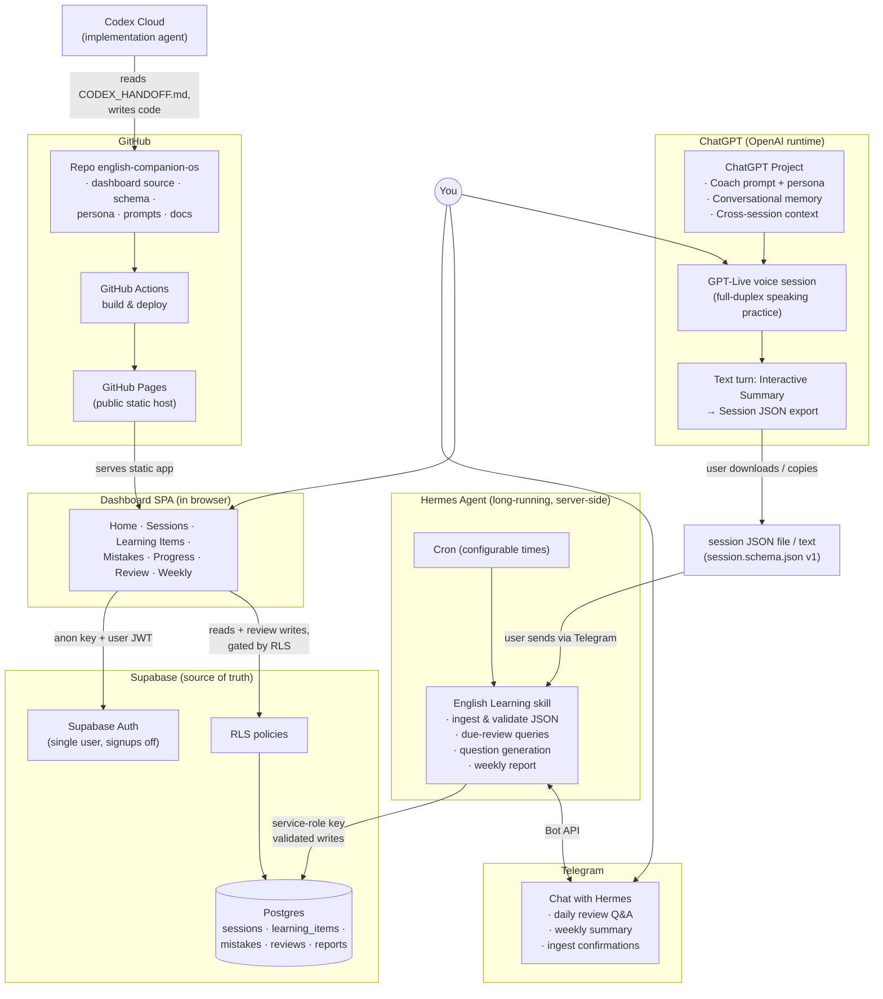

# English Companion OS — Master Plan (V1)

> **Document status:** Planning deliverable. This is the specification an implementation agent (Codex Cloud) builds from. No production code exists yet.
>
> **Verified vs. assumed:** Product facts below marked **[verified]** were checked against public sources in Aug 2026; facts marked **[assumption]** could not be verified and are explicitly flagged. Key verifications:
> - GPT-Live (launched July 2026) is OpenAI's full-duplex voice model family inside ChatGPT, and **it supports Projects** — voice conversations can reference recent project chats, sources, and project instructions. **[verified]**
> - GitHub Pages sites from non-Enterprise accounts are **always public**; private publishing requires GitHub Enterprise Cloud. **[verified]** → authentication must be real (Supabase Auth + RLS), not page-hiding.
> - Whether GPT-Live can emit a downloadable `.json` file directly *inside a live voice call* is **[assumption: probably not reliable]**. The design therefore performs JSON export as a *text turn in the same chat* after the voice part ends (see §F, §N). This works regardless.
> - Hermes Agent internals (skill format, memory files such as `SOUL`, cron mechanism) are treated as user-provided facts; the integration spec (§L) is written framework-agnostic so it survives Hermes upgrades. **[assumption where noted]**

---

## A. Executive Summary

**What it is.** A personal "English speaking companion operating system" for one learner. Spoken practice happens where it is best — GPT-Live inside a dedicated ChatGPT Project, with a persistent companion persona and conversational memory. Everything worth *keeping and measuring* — vocabulary, expressions, corrections, recurring mistakes, shadowing, focus areas — is exported after each session as a strict JSON document, ingested by the user's existing Hermes agent into Supabase, which becomes the **structured learning memory / source of truth**.

**What problem it solves.** ChatGPT memory is great for continuity but terrible as a database: you cannot query it, chart it, compute due reviews from it, or detect that you've made the same article mistake 12 times across 2 months. This system splits memory into two layers with a clean, manual-but-reliable bridge between them:

- **Conversational memory** → ChatGPT Project (owned by OpenAI's runtime, zero engineering)
- **Structured learning memory** → Supabase (owned by you, queryable forever)

**Core architecture.** Five mainstream, independently replaceable components:

1. **ChatGPT Project + GPT-Live** — practice + persona + interactive summary + JSON export (no code needed; prompt-driven).
2. **Session JSON (schema v1)** — the single contract between the AI conversation world and the data world.
3. **Hermes agent** — validating ingestion gateway, scheduled Telegram reviews, weekly reports. Holds the only write-privileged Supabase credential.
4. **Supabase** — Postgres + Auth + RLS. Normalized where queries need it, JSONB where they don't.
5. **Dashboard** — static React SPA on GitHub Pages (deployed by GitHub Actions), reading Supabase directly through Supabase Auth + RLS; includes a lightweight self-graded web review mode.

The bridge (GPT → Hermes) is **deliberately manual in V1**: copy/download the JSON, hand it to Hermes. No scraping, no browser extensions, no voice-stack rebuilding.

---

## B. Final Architecture Decision

### The recommended architecture (chosen, not a menu)

| Concern | Decision | Why |
|---|---|---|
| Speaking practice | ChatGPT Project + GPT-Live, prompt-only | Best-in-class voice already exists; Projects support GPT-Live **[verified]**; rebuilding voice is explicitly out of scope |
| Data contract | Single versioned `session.schema.json` (v1), unified `learning_items[]` array | One array with `type` beats parallel arrays for DB mapping, validation, and future item types (§F rationale) |
| Ingestion | Hermes receives JSON via Telegram (file or pasted text), validates with JSON Schema, writes via **service-role key** | Hermes already runs, already has Telegram, already has secret storage; keeps all write credentials server-side |
| Database | Supabase Postgres, ~7 normalized tables + `raw_json` JSONB escape hatch per session | Queryable for stats/SRS; raw JSON preserved so schema evolution never loses data |
| Dashboard hosting | GitHub Pages (public URL) + GitHub Actions deploy | User's existing stack; free; static |
| Dashboard auth | **Supabase Auth email/password, single manually-created user, signups disabled, RLS on every table** (Option A in §H) | Real security with near-zero code; "log in once, stay logged in" UX via supabase-js session persistence |
| Frontend stack | **React 18 + TypeScript + Vite + Tailwind CSS + React Router (HashRouter) + Recharts + supabase-js** | The most mainstream, best-documented, most vibe-coding-friendly stack; HashRouter avoids GitHub Pages SPA 404s with zero config |
| Web interactive review | **Self-graded "Daily Mix"** (show prompt → user answers mentally/typed → reveal answer → self-rate) | A static site cannot hold an LLM API key safely; self-grading needs no server. AI-graded review lives in Telegram where Hermes has an LLM |
| Spaced repetition | **Simple 5-level interval ladder** (Leiter-style: 1 / 3 / 7 / 14 / 30 days), Again/Hard/Good/Easy transitions | SM-2/FSRS is over-engineering for V1; a fixed ladder is debuggable, explainable, and easily replaced later |
| Telegram review | Hermes cron at a **user-configurable time** (stored in `user_settings`), 3–5 questions, sequential conversational flow, LLM-evaluated answers | Matches the companion feel; Telegram has no push limits relevant at this volume |
| Persona | `shared/persona.md` as canonical source; manually pasted into ChatGPT Project; consumed by Hermes for its SOUL/persona | Simplest thing that keeps one personality across two runtimes; no sync automation in V1 |

### The one alternative worth naming

**Dashboard reads via a thin API (Edge Functions) instead of direct supabase-js + RLS.** This would let the anon key never touch learning tables at all. Rejected for V1: it adds a deploy surface, more code, more debugging, and RLS-with-auth already meets every stated security requirement. If a future feature needs server-side logic in the dashboard path (e.g., AI grading on the web), add a single Supabase Edge Function then — the architecture doesn't change.

### Trade-offs accepted knowingly

- **Manual JSON handoff** costs ~30 seconds per session; in exchange the system has zero fragile automation and zero ToS risk.
- **GPT output quality is a soft dependency**: the schema + prompt are designed so a malformed export fails validation loudly in Hermes (with a human-readable error back over Telegram) instead of corrupting data.
- **Two review surfaces** (Telegram = AI-graded, Web = self-graded) is mild duplication; in exchange each surface uses only capabilities it safely has.
- **Fixed-interval SRS** is less optimal than FSRS; in exchange it is fully explainable ("this item is at level 3, so next review in 7 days") — which matters more for trust in a personal tool.

---

## C. Architecture Diagram



---

## D. Component Responsibilities

**ChatGPT Project**
- Owns: coach prompt + persona instructions, conversational memory, cross-session context ("we talked about your swim meet last week"), the container for all English practice chats.
- Does NOT: store structured data, talk to Supabase, know about the dashboard, sync with Hermes memory.

**GPT-Live**
- Owns: the actual spoken practice — natural conversation, corrections per the coach prompt, interactive summary, shadowing.
- Does NOT: emit JSON mid-voice-call (export is a text turn after wrap-up), invent data it didn't observe, get replaced or cloned by anything in this repo.

**Hermes Agent**
- Owns: the *only* write path into learning data — JSON validation and ingestion; scheduled Telegram reviews (question generation, answer evaluation, persistence); weekly report generation; all server-side secrets (Supabase service role key, Telegram bot token).
- Does NOT: conduct English speaking practice, serve the dashboard, hold frontend credentials.

**Supabase**
- Owns: source of truth for all structured learning data; authentication for the dashboard; row-level authorization (RLS).
- Does NOT: run scheduled jobs in V1 (Hermes cron does that), host frontend code, contain conversational memory.

**Dashboard (React SPA)**
- Owns: read-only visualization of all learning data; the self-graded web review flow (its one write path: `review_events` inserts); login UX.
- Does NOT: ingest sessions, hold any secret beyond the public anon key, call LLMs, work when logged out.

**Telegram**
- Owns: the notification + conversational-review channel; also the transport for handing session JSON to Hermes.
- Does NOT: replace the dashboard for browsing data. (LINE is explicitly out of V1.)

**GitHub (repo)**
- Owns: all source code, the canonical persona file, the canonical JSON schema, all documentation; the coordination point between the human and coding agents.
- Does NOT: contain any secret, any learning data, or any user-specific credential.

**GitHub Actions**
- Owns: building the dashboard and deploying it to GitHub Pages on push to `main`.
- Does NOT: touch Supabase data, run Hermes, run scheduled learning jobs.

**Codex Cloud**
- Owns: implementation of phases per `CODEX_HANDOFF.md`; opening PRs; keeping docs in sync with code it writes.
- Does NOT: change architecture decisions, schema versions, or security posture without an explicit human request; never commits secrets.

---

## E. End-to-End Data Flows

### Flow 1 — GPT-Live practice → Supabase

1. User opens the English Project, starts a GPT-Live session, practices (~20–40 min).
2. User signals wrap-up ("Let's summarize") → interactive summary → shadowing (all voice, per prompt §N).
3. User says "Save today's session" → the assistant (now in a text turn) emits one fenced JSON code block conforming to schema v1, preceded by one short confirmation sentence. Filename convention if downloaded: `YYYY-MM-DD_HH-mm_english-session.json`.
4. User forwards the JSON to Hermes over Telegram — as an attached `.json` file **or** pasted text (Hermes accepts both; pasted text must contain a parseable JSON object).
5. Hermes: parse → validate against `shared/schemas/session.schema.json` → semantic checks (date sanity, no empty-required fields) → idempotency check (duplicate session?) → transactional write:
   - insert `sessions` row (including full payload into `raw_json`),
   - upsert `learning_items` (dedupe by normalized text+type; increment `times_seen`; new items get review level 0 and `next_review_at = tomorrow`),
   - insert `session_learning_items` join rows,
   - insert `mistake_events` rows (one per correction; plus recurring-mistake records),
6. Hermes replies in Telegram: `✅ Ingested 2026-08-10 session: 35 min, 6 new items (2 seen before), 4 corrections, 1 recurring category (articles). 5 items due for review tomorrow.` On failure: a human-readable error naming the exact field, and **nothing is written**.

### Flow 2 — Supabase → Dashboard

1. User opens `https://<user>.github.io/english-companion-os/`. The SPA checks for a persisted Supabase session; if none → login screen (email/password, once); if present → straight to Home.
2. Authenticated supabase-js queries (anon key + user JWT) read data; RLS guarantees only rows with `user_id = auth.uid()` return. Logged-out or foreign requests get empty sets.
3. Views aggregate client-side (V1 data volumes are tiny: one user, a few sessions/week) with two or three SQL views for the heavier rollups (§G).

### Flow 3 — Supabase → Hermes cron → Telegram review

1. Hermes cron fires at the time configured in `user_settings.review_time` (+ timezone). No hard-coded schedule.
2. Skill queries: due learning items (`next_review_at <= today`, ordered by most overdue), top recurring mistake categories (last 30 days), newest items (last 3 sessions), latest `next_session_focus`.
3. Generates 3–5 questions (mix per §K), avoiding any (item, question_type) pair used in the last 14 days.
4. Sends the first question in Telegram; conversation proceeds question-by-question (§K UX).

### Flow 4 — Telegram answer → review result → Supabase

1. User replies to a question in natural text.
2. Hermes' LLM evaluates against the expected answer with a rubric → verdict + one-line feedback + rating **Again / Hard / Good / Easy** (user can override by replying e.g. "mark that easy").
3. Hermes inserts a `review_events` row (question, answer, evaluation, rating, channel=`telegram`) and updates the item's ladder: Again→level 0 (due tomorrow), Hard→stay (half interval), Good→+1 level, Easy→+2 levels; `next_review_at` = today + new level's interval. Items reaching level 5 with 2 consecutive Good/Easy are marked `mastered` (still queryable, excluded from due queues).
4. After the last question: a short recap (`4/5 natural — "follow through" is solid now; articles still need work`).

### Flow 5 — Weekly report

1. Hermes cron (default Sunday 20:00 local, configurable) computes the week's stats from Supabase: speaking minutes, session count, new items, review completion, most-improved category (frequency ↓ vs prior 3-week average), still-recurring categories, suggested next-week focus.
2. Writes one `weekly_reports` row (stats JSONB + generated narrative), upserted on `(user_id, week_start)`.
3. Sends a compact Telegram summary; the Dashboard's Weekly page renders the full report from the same row.
4. The `suggested focus` line is also something the user can mention verbally in the next GPT-Live session ("this week we're working on articles") — closing the loop without any automation.

---

## F. English Session JSON Schema v1

### Design decision: unified `learning_items[]`, separate `corrections[]`

One array with a `type` discriminator (instead of parallel `vocabulary` / `phrases` / `idioms` arrays) wins on every axis evaluated:

- **Database design:** maps 1:1 onto a single `learning_items` table — no per-type tables, no UNION queries.
- **Maintainability:** adding a type (e.g., `filler`) is a one-line enum change, not a new array + new table + new UI section.
- **GPT generation reliability:** one repeated object shape is easier for a model to emit consistently than four differently-shaped arrays.
- **Hermes parsing:** one validation loop, one upsert path.
- **Dashboard rendering:** one list component with a type filter chip, exactly matching the Learning Items page design (§I).

`corrections`, `recurring_mistakes`, `pronunciation_notes`, and `shadowing` stay separate because they are structurally different things (events/observations, not memorizable items) and feed different tables and pages.

### Conceptual schema (`shared/schemas/session.schema.json`)

Top level — all keys required; "nullable" / "may be empty" as noted. GPT must output `null` / `[]` for anything it doesn't actually know — **never invent** durations, pronunciation issues, or mistakes that didn't occur.

| Field | Type | Required | Notes |
|---|---|---|---|
| `schema_version` | string, const `"1.0"` | ✅ | Hermes rejects unknown versions |
| `session_date` | string `YYYY-MM-DD` | ✅ | Local date of practice |
| `session_start_time` | string `HH:MM` \| null | ✅ (nullable) | null when unknown |
| `duration_minutes` | integer 1–240 \| null | ✅ (nullable) | null when unknown — never guessed |
| `topics` | string[] (1–10 items) | ✅ | Short lowercase topic labels |
| `session_summary` | string (1–2000 chars) | ✅ | 2–5 sentence prose summary |
| `learning_items` | LearningItem[] | ✅ (may be `[]`) | See below |
| `corrections` | Correction[] | ✅ (may be `[]`) | Only real, in-session corrections |
| `recurring_mistakes` | RecurringMistake[] | ✅ (may be `[]`) | Only patterns actually recurring |
| `pronunciation_notes` | PronunciationNote[] | ✅ (may be `[]`) | Only actually-observed issues |
| `shadowing` | string[] (0–8) | ✅ (may be `[]`) | The exact shadowed sentences |
| `next_session_focus` | string \| null | ✅ (nullable) | One concrete focus suggestion |
| `memory_candidates` | string[] | ✅ (may be `[]`) | Personal facts worth long-term memory ("training for a triathlon in October") |

**LearningItem**

| Field | Type | Required | Notes |
|---|---|---|---|
| `type` | enum: `vocabulary` · `phrase` · `phrasal_verb` · `collocation` · `natural_expression` · `idiom` · `pattern` | ✅ | Closed enum in v1 |
| `text` | string (1–200) | ✅ | The item itself, canonical casing |
| `meaning` | string | ✅ | Plain-English meaning/usage note |
| `example` | string | ✅ | A natural example sentence — ideally from today's conversation |
| `note` | string \| null | ✅ (nullable) | Register, nuance, common pairing |
| `importance` | enum `high` · `medium` · `low` \| null | ✅ (nullable) | Coach's judgment; `high` for user-requested "add to my vocabulary" items |

**Correction**

| Field | Type | Required | Notes |
|---|---|---|---|
| `original` | string | ✅ | What the learner actually said |
| `corrected` | string | ✅ | Natural native version |
| `explanation` | string | ✅ | One sentence |
| `category` | enum (below) \| null | ✅ (nullable) | Drives the Mistakes page aggregation |

`category` enum v1: `articles` · `verb_tense` · `prepositions` · `plurals` · `word_choice` · `word_order` · `subject_verb_agreement` · `unnatural_phrasing` · `pronunciation` · `other`. A closed enum (with `other` as escape valve) is essential — free-text categories would fragment the long-term mistake statistics that motivate the whole Mistakes page.

**RecurringMistake**: `category` (same enum, required) · `description` (string, required) · `examples` (string[], may be empty).

**PronunciationNote**: `word_or_sound` (string, required) · `note` (string, required).

### Full realistic example

```json
{
  "schema_version": "1.0",
  "session_date": "2026-08-10",
  "session_start_time": "21:15",
  "duration_minutes": 35,
  "topics": ["swimming", "weekend plans", "work stress"],
  "session_summary": "We caught up about the weekend and the open-water swim on Saturday. You described the race conditions in good detail and we worked on past-tense narration. We also talked about a stressful project deadline and practiced softer ways to complain about work.",
  "learning_items": [
    {
      "type": "phrasal_verb",
      "text": "follow through",
      "meaning": "to actually complete something you said you would do",
      "example": "I signed up for the race, so now I have to follow through.",
      "note": "often 'follow through on/with something'",
      "importance": "high"
    },
    {
      "type": "natural_expression",
      "text": "I'm swamped",
      "meaning": "a natural way to say you are extremely busy",
      "example": "Sorry I didn't reply — I've been swamped at work this week.",
      "note": "casual; fine with colleagues, avoid in formal writing",
      "importance": "medium"
    },
    {
      "type": "collocation",
      "text": "meet a deadline",
      "meaning": "to finish work by the required time",
      "example": "We barely met the deadline on Friday.",
      "note": "'meet' not 'catch' or 'reach' a deadline",
      "importance": "medium"
    },
    {
      "type": "idiom",
      "text": "second wind",
      "meaning": "a new burst of energy after feeling tired",
      "example": "Halfway through the swim I got my second wind.",
      "note": null,
      "importance": "low"
    }
  ],
  "corrections": [
    {
      "original": "I went to swimming pool yesterday morning.",
      "corrected": "I went to the swimming pool yesterday morning.",
      "explanation": "Specific known places need 'the'.",
      "category": "articles"
    },
    {
      "original": "The water have many waves.",
      "corrected": "The water was really choppy.",
      "explanation": "'Choppy' is the natural word, and 'water' takes a singular verb.",
      "category": "unnatural_phrasing"
    },
    {
      "original": "I didn't went to the office on Friday.",
      "corrected": "I didn't go to the office on Friday.",
      "explanation": "After 'didn't', use the base verb.",
      "category": "verb_tense"
    }
  ],
  "recurring_mistakes": [
    {
      "category": "articles",
      "description": "Dropping 'the' before specific places (pool, office, gym).",
      "examples": ["I went to swimming pool", "I'm at office now"]
    }
  ],
  "pronunciation_notes": [
    {
      "word_or_sound": "choppy",
      "note": "First vowel is /ɑ/ as in 'hot', not /oʊ/."
    }
  ],
  "shadowing": [
    "I signed up for the race, so now I have to follow through.",
    "The water was really choppy, but I got my second wind halfway.",
    "I've been swamped, but we barely met the deadline."
  ],
  "next_session_focus": "Past-tense narration of a full story without switching to present tense.",
  "memory_candidates": [
    "Did an open-water swim race on 2026-08-08 and wants to do a longer one in October."
  ]
}
```

### Validation & evolution rules

- Hermes validates with a real JSON Schema validator (Ajv) against the committed schema file — never "looks about right" parsing.
- Unknown top-level keys → **warning, ignored** (forward compatibility); missing required keys or type mismatches → **hard reject** with a field-precise Telegram error.
- Schema changes bump `schema_version`; Hermes keeps validators for every version it has ever accepted. `sessions.raw_json` preserves the original payload so old rows can be re-migrated if extraction logic improves.

---

## G. Supabase Database Schema

### Design stance

Normalize exactly what gets queried/aggregated (items, mistakes, reviews, sessions-as-rows); keep JSONB for display-only or archival blobs (shadowing lines, pronunciation notes, raw payload, report stats). Every table carries `user_id` referencing `auth.users` — the entire multi-user future costs one column and one RLS pattern now, and nothing else.

### Tables

**`sessions`** — one row per practice session.
- `id uuid PK default gen_random_uuid()`
- `user_id uuid NOT NULL → auth.users(id)`
- `session_date date NOT NULL`, `start_time time NULL`, `duration_minutes int NULL`
- `topics text[] NOT NULL default '{}'`
- `summary text NOT NULL`
- `next_session_focus text NULL`
- `shadowing jsonb NOT NULL default '[]'` — display-only → JSONB
- `pronunciation_notes jsonb NOT NULL default '[]'` — display-only → JSONB
- `memory_candidates jsonb NOT NULL default '[]'`
- `raw_json jsonb NOT NULL` — full original payload (archival escape hatch)
- `schema_version text NOT NULL`, `source text NOT NULL default 'gpt-live'`, `created_at timestamptz default now()`
- Unique: `(user_id, session_date, coalesce(start_time,'00:00'))` — idempotent re-ingestion. Index: `(user_id, session_date desc)`.

**`learning_items`** — one row per distinct item the learner is acquiring (deduped across sessions).
- `id uuid PK`, `user_id uuid NOT NULL`
- `type text NOT NULL CHECK (type in ('vocabulary','phrase','phrasal_verb','collocation','natural_expression','idiom','pattern'))`
- `text text NOT NULL`, `normalized_text text NOT NULL` (lowercased/trimmed, generated) — Unique `(user_id, type, normalized_text)` for dedupe
- `meaning text NOT NULL`, `example text NOT NULL`, `note text NULL`, `importance text NULL`
- `first_session_id uuid NULL → sessions(id)`, `times_seen int NOT NULL default 1`
- SRS state: `review_level int NOT NULL default 0` (0–5), `next_review_at date NOT NULL`, `last_reviewed_at timestamptz NULL`, `consecutive_good int NOT NULL default 0`
- `status text NOT NULL default 'active' CHECK (status in ('active','mastered','archived'))`
- `created_at`, `updated_at`
- Indexes: `(user_id, status, next_review_at)` — the due-review query; `(user_id, type)`.

**`session_learning_items`** — occurrence join (which sessions an item appeared in).
- `session_id uuid → sessions(id) on delete cascade`, `learning_item_id uuid → learning_items(id) on delete cascade`, `user_id uuid NOT NULL`, `example_in_session text NULL`
- PK `(session_id, learning_item_id)`.

**`mistake_events`** — one row per correction (and per recurring-mistake example), the atom of long-term error analytics.
- `id uuid PK`, `user_id uuid NOT NULL`, `session_id uuid NOT NULL → sessions(id) on delete cascade`
- `category text NOT NULL` (the closed enum, `other` fallback)
- `original text NOT NULL`, `corrected text NULL`, `explanation text NULL`
- `is_recurring bool NOT NULL default false` (true when sourced from `recurring_mistakes[]`)
- `created_at`
- Indexes: `(user_id, category, created_at desc)` — the Mistakes page; `(user_id, session_id)`.

**`review_events`** — one row per answered review question (append-only).
- `id uuid PK`, `user_id uuid NOT NULL`
- `learning_item_id uuid NULL → learning_items(id)` (null for mistake-category questions)
- `mistake_category text NULL` — exactly one of the two targets is set (CHECK)
- `channel text NOT NULL CHECK (channel in ('telegram','web'))`
- `question_type text NOT NULL` (enum §K), `question text NOT NULL`, `user_answer text NULL`, `evaluation text NULL`
- `rating text NOT NULL CHECK (rating in ('again','hard','good','easy'))`
- `created_at`
- Indexes: `(user_id, learning_item_id, created_at desc)` — dedupe window & history; `(user_id, created_at desc)`.

**`weekly_reports`** — one row per week.
- `id uuid PK`, `user_id uuid NOT NULL`, `week_start date NOT NULL` (Monday) — Unique `(user_id, week_start)`
- `stats jsonb NOT NULL` (metrics: minutes, sessions, new_items, reviews_done, reviews_due, top_mistakes, improved_categories…) — computed rollup, display-only → JSONB
- `narrative text NOT NULL` (the human-readable report), `suggested_focus text NULL`, `created_at`

**`user_settings`** — one row per user.
- `user_id uuid PK → auth.users(id)`
- `timezone text NOT NULL default 'UTC'` — set per-user at setup time (an IANA tz name); drives all cron scheduling
- `daily_review_enabled bool default true`, `review_time time NOT NULL default '20:30'`, `questions_per_review int default 4 CHECK (between 3 and 5)`
- `weekly_report_enabled bool default true`, `weekly_report_day int default 0` (0=Sunday), `weekly_report_time time default '20:00'`
- `telegram_chat_id text NULL` — points at the **dedicated language-learning group** (the user and their companion only), kept separate from the general task chat so review replies never mix with normal tasks
- `srs_intervals int[] NOT NULL default '{1,3,7,14,30}'` — the ladder, editable without code changes
- `agent_name text NOT NULL default 'Companion'` — the user's own name for their companion; **per-user, no shared default name** (each user sets their own; the real name is written into Supabase at setup time, not stored in the repo). It is the first per-user persona override. Broader per-user customization (tone/traits) would extend this with a `persona_overrides jsonb` column, merged over the Git name-less template at runtime (see §M forward path). Not built in V1.

Deliberately **not** created in V1: a `review_queue` table (due-ness is derived from `next_review_at`), a `topics` table (Postgres `text[]` + `unnest()` covers topic stats), per-type item tables.

### SQL views (for heavier rollups)

- `v_weekly_activity` — per ISO week: total minutes, session count, new items, reviews done.
- `v_mistake_category_stats` — per category: total count, count last 30 days, count previous 30 days (trend arrow on Mistakes page).
- `v_due_reviews` — active items where `next_review_at <= current_date`, ordered by overdue-ness (used by both Hermes and the web Review page).

### How a Session JSON becomes rows (ingestion mapping)

One transaction per ingest:
1. `sessions` ← top-level fields + `raw_json` (reject on unique violation → "already ingested" reply).
2. For each `learning_items[]` entry: match on `(user_id, type, normalized(text))`. **Miss** → insert with `review_level 0`, `next_review_at = tomorrow`, `first_session_id = this`. **Hit** → `times_seen += 1`, refresh `meaning/example` only if previously null. Either way insert `session_learning_items` join row with the session example.
3. Each `corrections[]` entry → `mistake_events` (is_recurring=false). Each `recurring_mistakes[]` example → `mistake_events` (is_recurring=true, corrected/explanation from the description).
4. `shadowing`, `pronunciation_notes`, `memory_candidates` stay inside the session row (JSONB) — read per-session, never aggregated in V1.

### RLS strategy

- RLS **enabled on every table**. No table readable via bare anon key.
- Authenticated user policies: `SELECT` on all tables `USING (user_id = auth.uid())`; `INSERT` on `review_events` `WITH CHECK (user_id = auth.uid() AND channel = 'web')`; `UPDATE` on `user_settings` and on `learning_items` **limited to SRS columns** (via a `security definer` function `apply_review_rating(item_id, rating)` rather than a broad UPDATE policy — the function is the only way the browser can move SRS state, keeping the transition logic in one audited place).
- Hermes uses the **service role key** (bypasses RLS) from server-side env only. The anon key alone (no login) can read nothing — satisfying "knowing the Supabase URL must reveal nothing."
- Multi-user later = create another auth user + settings row. Zero schema change.

---

## H. Authentication & Security Design

**Problem:** GitHub Pages is public **[verified — private Pages requires Enterprise Cloud]**, but the data is personal.
**Principle:** the page may be public; the *data* must not be. Security lives at the API/database layer, never in the page.

### Options analyzed

**A. Supabase Auth email/password, single manually-created user (✅ chosen)**
- Setup: create one user in the Supabase dashboard; **disable public signups**; frontend ships only URL + anon key (both safe to publish — all authority comes from RLS + JWT).
- UX: login once; supabase-js persists the session in localStorage and silently refreshes tokens — "open → already logged in" for months. Exactly the requested UX.
- Security: industry-standard auth, tokens scoped by RLS, no custom crypto, ~40 lines of frontend code.

**B. Password-only UX + backend verification (rejected)**
- A single shared password checked by an Edge Function that mints a token. Recreates auth (rate limiting, token lifecycle, rotation) by hand, adds a server component, and is strictly less secure than A for *more* code. The only gain — not typing an email — is negligible for a returning session that stays logged in anyway.

**C. Magic-link / OTP login (rejected for V1)**
- Same security as A, but every re-login round-trips through the email inbox — worse UX on mobile for a personal daily tool. Trivial to add later as an alternate login method since it's the same Supabase Auth.

### Security requirements → mechanisms

| Requirement | Mechanism |
|---|---|
| No service-role secret in frontend | Frontend gets anon key only; service key lives exclusively in Hermes' server env |
| Knowing the Supabase URL reveals nothing | RLS on all tables; zero anon-role policies |
| Unauthenticated users get no learning data | All read policies require `auth.uid()` match |
| Secrets in proper storage | Hermes host env/secret store; GitHub Actions needs **no** Supabase secret (anon key + URL are public build-time constants, set as repo variables for cleanliness) |
| Hermes write vs. browser write separation | Hermes: service role (full). Browser: RLS-scoped reads + `review_events` insert + the `apply_review_rating()` function. The browser **cannot** create sessions, items, or mistakes |
| No secrets in git | `.env*` gitignored from day one; `docs/security.md` checklist; Supabase keys never appear in the repo |

### Access model — three principals, three permission levels

The static site holds **no secret**. Supabase's anon key is *designed to be public*; it grants nothing on its own, because every table's RLS denies it. Authority comes from the per-login JWT, not from keeping a key hidden. The only real secret (service role) lives solely in Hermes.

| Principal | Key it holds | Where the key lives | What it can do |
|---|---|---|---|
| Logged-out visitor | anon key only | public (shipped in the JS bundle) | **nothing** — RLS denies every table |
| Dashboard (logged-in user) | anon key + user JWT | JWT in browser localStorage, auto-refreshed by supabase-js | read own rows; insert own `review_events`; update own `user_settings`; call `apply_review_rating()`. **Cannot** create sessions, learning_items, or mistake_events |
| Hermes agent | **service role key** | Hermes server env only — never git, browser, ChatGPT, or logs | full read/write; bypasses RLS |

The middle row vs. the bottom row *is* the required "Hermes write authority separated from the browser": the browser is a near-read-only client with one narrow write path (`review_events` + the SRS function); all ingestion and learning-data writes require the service role, which the browser never sees.

Residual risks, accepted: anon key is public by design (harmless under RLS); a compromised user password exposes one user's data (use a strong password + Supabase's built-in rate limiting); GitHub Pages URL is discoverable (reveals only a login screen).

---

## I. Dashboard Product Specification

**Design personality:** modern personal learning app — warm, calm, a little companion-like. One accent color, generous whitespace, rounded cards, the agent's name and a short encouraging line on Home. No corporate-BI grids, no XP bars, no cartoon mascots.

### Navigation & page structure

Seven routes. Mobile: bottom tab bar with 4 primary tabs (Home · Sessions · Items · Review) + "More" sheet (Mistakes · Progress · Weekly). Desktop: left sidebar with all seven. (HashRouter URLs: `#/`, `#/sessions`, `#/sessions/:id`, `#/items`, `#/mistakes`, `#/progress`, `#/review`, `#/weekly`.)

**HOME** — "how am I doing right now"
- Greeting from {{AGENT_NAME}} + one context line ("5 items due — got 5 minutes?").
- Stat row: This-week speaking minutes · sessions · streak (weeks with ≥1 session — *weekly* streak, kinder than daily for a practice cadence that isn't daily) · due reviews.
- Current focus card (latest `next_session_focus`).
- "Start review" CTA when due > 0 → `#/review`.
- Last session card (date, topics, minutes) → detail.
- 8-week activity mini bar chart.

**SESSIONS** — list (newest first): date, topic chips, duration, item/correction counts. **Session detail:** summary → topics → learning items (grouped by type) → corrections (Original ▸ Natural ▸ Why) → recurring mistakes → shadowing lines → pronunciation notes → next focus. Pure reading view; no editing in V1.

**LEARNING ITEMS** — the collection. Search box (text/meaning), type filter chips (All · Vocabulary · Phrasal verbs · Expressions · Idioms · Collocations · Patterns), status filter (Active · Mastered). Each row: text, type badge, mastery dots (●●●○○ = review_level), times seen, next review date. Detail (expand or sheet): meaning, example(s), note, first-seen session link, per-session occurrences, review history.

**MISTAKES** — long-term error observatory. Category list ranked by count with 30-day trend arrows (↓ improving / → flat / ↑ growing) from `v_mistake_category_stats`. Category detail: description, sparkline of monthly occurrences, and the actual evidence — every event as `Original / Natural / date → session link`.

**PROGRESS** — only metrics that answer a real question:
1. Speaking minutes/week (last 12 weeks, bar) — *am I practicing enough?*
2. Review completion (done vs. due, weekly) — *am I retaining?*
3. Mistake trend (top-4 categories over 12 weeks) — *am I actually improving?*
4. Cumulative mastered items (line) — *is the collection growing into knowledge?*
Explicitly excluded: topic-diversity charts, radar charts, per-day heatmaps — no decision would ever change based on them.

**REVIEW** — the interactive web review (full design §J).

**WEEKLY** — decision: **independent page**, not a Home widget. Rationale: a report is an archive-shaped object (list of weeks → detail), it maps 1:1 to `weekly_reports` rows and the Telegram summary, and Home stays a *now* surface while Weekly is a *reflection* surface. Home links to the latest report. Detail renders `narrative` + stat grid + "compare to previous week" deltas.

### Wireframes

Mobile Home / Desktop Home:

```
┌──────────────────────────┐   ┌────────┬────────────────────────────────────┐
│  Hi! I'm {{AGENT_NAME}}  │   │ ⌂ Home │  Hi 👋  5 items due — got 5 min?   │
│  5 items due — 5 min?    │   │ Sessions│ ┌────────┬────────┬────────┬─────┐│
│ ┌─────────┬────────────┐ │   │ Items  │ │ 78 min │ 3 sess │ 6-wk 🔥│ 5 due││
│ │ 78 min  │ 3 sessions │ │   │ Mistakes│ └────────┴────────┴────────┴─────┘│
│ ├─────────┼────────────┤ │   │ Progress│ ┌───────────────┐ ┌──────────────┐│
│ │ 6-wk 🔥 │ 5 due      │ │   │ Review │ │ FOCUS         │ │ LAST SESSION ││
│ └─────────┴────────────┘ │   │ Weekly │ │ Past-tense    │ │ Aug 10 ·35min││
│ ▶ Current focus:         │   │        │ │ narration     │ │ swimming,    ││
│   Past-tense narration   │   │  ————  │ └───────────────┘ │ work stress  ││
│ ┌──────────────────────┐ │   │ Logout │ ┌──────────────────────────────┐  │
│ │ ▶ Start review (5)   │ │   │        │ │ ▂▄▂▆▄█▆▇  8-week activity    │  │
│ └──────────────────────┘ │   └────────┴─└──────────────────────────────┘──┘
│ Last: Aug 10 · swimming  │
│ ▂▄▂▆▄█▆▇                 │
├──────────────────────────┤
│  ⌂    ▤    ✦    ▶   ⋯   │  ← Home · Sessions · Items · Review · More
└──────────────────────────┘
```

Session detail (mobile) / Mistakes (desktop):

```
┌──────────────────────────┐   ┌─────────────────────────────────────────────┐
│ ← Aug 10 · 35 min        │   │ MISTAKES                                    │
│ swimming · work stress   │   │ Articles          12 ▂▄▆▄▂  ↓ improving     │
│ ─ Summary ─────────────  │   │ Verb tense         8 ▂▂▄▄▄  → flat          │
│ We caught up about the…  │   │ Prepositions       6 ▄▂▂▄▂  ↓ improving     │
│ ─ Learning items (4) ──  │   │ Unnatural phrasing 5 ▂▄▂▂▆  ↑ growing       │
│ [phrasal] follow through │   │ ┌─ Articles ──────────────────────────────┐ │
│ [expr]    I'm swamped    │   │ │ Dropping 'the' before specific places   │ │
│ ─ Corrections (3) ─────  │   │ │ ✗ I went to swimming pool     Aug 10 ↗ │ │
│ ✗ I didn't went to…      │   │ │ ✓ I went to the swimming pool          │ │
│ ✓ I didn't go to…        │   │ │ ✗ I'm at office now           Aug 06 ↗ │ │
│   After 'didn't', base   │   │ └─────────────────────────────────────────┘ │
│   verb.                  │   └─────────────────────────────────────────────┘
│ ─ Shadowing (3) ───────  │
└──────────────────────────┘
```

### UX requirements

- Responsive from 360 px; every chart inside horizontally-scrollable containers on mobile.
- Loading skeletons, friendly empty states ("No sessions yet — go practice with {{AGENT_NAME}}! 🎧").
- Login screen: centered card, email + password, "stay signed in" is the default behavior.
- Dark mode: follow system (`prefers-color-scheme`) — Tailwind makes this cheap; no toggle in V1.
- All data fetched at view level from Supabase; **nothing learning-related baked into the build**.

---

## J. Interactive Web Review Design

Constraint that shapes everything: a static GitHub Pages site **cannot safely call an LLM** (no key storage). So V1 web review must work with *stored data + self-assessment*. AI-graded review remains Telegram's job. The two surfaces intentionally complement rather than duplicate.

### Concept 1 — "Daily Mix" (self-graded micro-session) ✅ recommended

- **User flow:** Review tab → "Start (7 due)" → one card at a time → card shows a prompt → user answers *out loud or in their head* (optionally types) → taps **Show answer** → sees expected answer + note → self-rates **Again / Hard / Good / Easy** → next card → recap screen (n reviewed, next due date, one encouraging line). 3–10 minutes, closable anytime (progress saved per card).
- **Question types (generated client-side from stored data, no LLM):**
  - *Meaning → say it*: "How would you naturally say: **to actually complete something you promised**?" → `follow through`
  - *Cloze from stored example*: "I signed up for the race, so now I have to ______." (item text blanked out of its own example)
  - *Fix the sentence* (from `mistake_events`): "❌ I didn't went there." → reveal the stored correction + explanation
  - *Use it yourself*: "Make your own sentence with **I'm swamped**" → typed/spoken, reveal shows the stored example for comparison (self-judged)
- **Supabase usage:** reads `v_due_reviews` + recent `mistake_events`; writes one `review_events` row (channel `web`) per card and calls `apply_review_rating()` to move the SRS ladder.
- **Pros:** works fully within static-site constraints; genuinely spoken-English-shaped (production prompts, not recognition flashcards); shares the SRS ladder with Telegram so both surfaces drain one queue; small implementation.
- **Cons:** no objective grading — honesty required (acceptable: audience of one, and Telegram provides the AI-graded counterweight).
- **Complexity:** Low-medium (~3–4 components + question-builder module).

### Concept 2 — "Rewrite Studio" (correction-focused typing practice)

- Flow: pick a mistake category → shown your *actual* old wrong sentences one by one → type the natural version → client-side diff against the stored correction (token-level, forgiving) → tentative auto-grade the user can override.
- Pros: directly attacks recurring mistakes with your own history; typing forces production; semi-objective grading without an LLM.
- Cons: string-diff grading is brittle (many valid rewrites score "wrong" → frustration); covers only mistakes, not new-item acquisition; typing-shaped rather than speaking-shaped.
- Complexity: Medium (diff/normalization logic is fiddly).

### Concept 3 — "Shadowing Replay" (speak-along session)

- Flow: pick a recent session → its shadowing lines shown one at a time with large type → user reads aloud → self-advance; optional browser TTS (`speechSynthesis`) reads the line first; end card logs a completion `review_event`.
- Pros: closest to actual speaking; near-trivial to build; nice mobile experience.
- Cons: no retrieval practice (reading ≠ recalling); TTS voice quality varies by device; weak SRS integration (lines aren't items).
- Complexity: Low.

### Decision

**V1 ships Concept 1 (Daily Mix).** It is the only concept that exercises *retrieval* (the thing SRS needs), integrates with the shared review ladder, and covers both items and mistakes. Concept 3 is a cheap Phase 6 add-on inside the session detail page ("Replay shadowing"). Concept 2 is deferred; its best question type (*Fix the sentence*) is already inside Daily Mix with self-grading instead of brittle diffing.

---

## K. Telegram + Hermes Review System

### Scheduling

- Hermes cron evaluates every configured job against `user_settings` (`review_time`, `timezone`, `daily_review_enabled`, `weekly_report_*`). Changing the time = updating a DB row (via Telegram: "move my review to 21:00" → Hermes updates settings), **no code or cron edits**. **[assumption: Hermes cron can run at least every 15 min or at named times; spec requires only "fires within ~15 min of the configured time"]**
- Skip rule: if zero items are due AND no recent mistakes exist, send nothing (silence beats filler). If the user hasn't practiced in 7+ days, the daily slot sends one gentle nudge instead of questions (max once per week).

### Question generation (3–5 per day, per settings)

Selection mix (degrading gracefully when pools are small):
- ~2 due items (most overdue first; `importance=high` breaks ties)
- ~1 recent recurring-mistake category (weighted by 30-day frequency)
- ~1 fresh item from the last 3 sessions (early reinforcement even if not "due")
- ~1 production question tied to the current `next_session_focus`

Question types (enum stored on `review_events.question_type`): `fix_sentence` · `how_would_you_say` · `fill_blank` · `choose_natural` · `use_in_sentence` · `rewrite_natural` · `conversational_reply`. All conversational in tone — never TOEIC-style ("Which of the following…"). Generated by Hermes' LLM from the item/mistake data, with the *expected answer* and a short rubric produced at generation time and held in the review-session state.

**Anti-repetition:** before selecting, query `review_events` for the last 14 days; exclude any (learning_item_id, question_type) pair already used; prefer the least-recently-reviewed candidates; rotate question types per item so the same item is probed differently each cycle. Because questions are LLM-generated from data each time (not from a fixed bank), wording naturally varies too.

### Conversation UX (sequential, one question at a time)

```
Hermes: 🌆 Evening review — 4 quick ones today.
        1/4 · Fix this sentence:
        ❌ "I didn't went to the office on Friday."
You:    I didn't go to the office on Friday
Hermes: ✅ Exactly. "didn't" already carries the past, so the verb stays base.
        2/4 · How would you naturally say you're extremely busy?
You:    I'm swamped
Hermes: 💪 Perfect — that's the one. …
        …
Hermes: Done! 4/4 — "follow through" is rock solid now (that's 3 sessions
        in a row). Articles still wobble a little; I'll keep an eye on it.
        See you at practice 🎧
```

- Answers are free text; "skip" moves on (recorded as `again` with evaluation "skipped"); "stop" ends the session gracefully; an unanswered session times out after 4 hours (unanswered questions get **no** review_event — unasked ≠ failed, and the items simply stay due).
- Review-session state (current question index, expected answers) lives in Hermes' working memory keyed by chat; every *answered* question is persisted to Supabase immediately, so a crash loses at most the in-flight question. **[assumption: Hermes can hold small per-conversation state between messages]**

### Scoring → Again / Hard / Good / Easy

LLM rubric applied to each answer:
- **easy** — correct, natural, effectively instant/confident
- **good** — correct with minor roughness (small typo, slightly unnatural but fine)
- **hard** — right idea, wrong execution (needed the hint, partial answer)
- **again** — incorrect, blank, or skipped

The verdict is shown implicitly through feedback tone, not as a grade ("✅ exactly" / "close — the natural version is …"). User override: replying "that was easy" / "mark it hard" within the session updates the last event. Mistake-category questions log the event for analytics but move no SRS ladder (categories aren't scheduled items; they fade from selection as their 30-day frequency drops — i.e., as the user stops making them in real sessions).

### SRS ladder (shared with web review — one queue, two doors)

Intervals from `user_settings.srs_intervals`, default `[1, 3, 7, 14, 30]` days for levels 1–5; level 0 = due tomorrow.

| Rating | Level change | Next review |
|---|---|---|
| again | → 0 | +1 day |
| hard | stays | + half the current level's interval (min 1 day) |
| good | +1 (max 5) | + new level's interval |
| easy | +2 (max 5) | + new level's interval |

Mastery: level 5 AND `consecutive_good ≥ 2` → `status = mastered` (leaves the queue, stays searchable; any later `again` from a spontaneous re-encounter reactivates it). This whole policy lives in **one module** (`srs.ts`, shared conceptually between Hermes and the dashboard's `apply_review_rating()` SQL function) so a future FSRS upgrade is a single-module swap.

### Weekly summary (Telegram side of Flow 5)

Compact fixed format, generated from the same `weekly_reports` row the dashboard shows:

```
📊 Week of Aug 4–10
🗣 78 min · 3 sessions (streak: 6 weeks)
✨ 11 new expressions · ✅ 18/22 reviews done
📈 Biggest win: prepositions ↓ 60% vs. last month
🔁 Still recurring: articles (4×)
🎯 Next week: past-tense storytelling
Full report → <dashboard link>
```

---

## L. Hermes Integration Specification

Written framework-agnostic: capabilities + contracts, not file formats. **[assumption: Hermes supports custom skills/tools with instructions + executable scripts + env-based secrets + cron — per user description]**

### Skill: `english-learning`

Six capabilities (names indicative; adapt to Hermes' native convention):

1. **`ingest_session(json_text | file)`** — parse → Ajv-validate against `shared/schemas/session.schema.json` → semantic checks (session_date within ±7 days unless user confirms; duration ≤ 240) → duplicate check → transactional write per §G mapping → Telegram confirmation with ingest stats. Errors are human sentences naming the field, never stack traces. Also surfaces `memory_candidates` to Hermes' own long-term memory (its native mechanism) so Telegram small-talk stays continuous with practice life.
2. **`get_due_reviews(limit)`** — reads `v_due_reviews` + recent mistake stats; returns candidate pool for generation.
3. **`generate_daily_review()`** — cron entry point implementing §K (selection → generation → conversation loop).
4. **`save_review_result(...)`** — inserts `review_events`, applies the SRS transition to `learning_items`.
5. **`generate_weekly_report()`** — cron entry point implementing Flow 5.
6. **`get_learning_stats(period)`** — on-demand stats so the user can ask Hermes "how was my English this month?" in normal chat.

Implementation shape: a small **TypeScript/Node package** in `hermes/skills/english-learning/` (validator, supabase client, srs module, ingest/report scripts) that Hermes invokes as tools/scripts. Node because the dashboard is already TS — one language, shared schema file, shared SRS constants.

### Secrets (Hermes host environment / secret store only)

| Secret | Purpose | Never in |
|---|---|---|
| `SUPABASE_URL` | project endpoint | (public anyway, but env-configured) |
| `SUPABASE_SERVICE_ROLE_KEY` | RLS-bypassing writes | git, browser, ChatGPT, logs |
| `ECOS_USER_ID` | the auth user's UUID to stamp on rows | git (env-configured) |
| Telegram bot token | already held by Hermes | git, browser |

Repo ships `.env.example` with names only. `.gitignore` excludes all `.env*` from the first commit.

### Behavioral rules

- Never write to Supabase without full schema validation passing.
- Ingestion is idempotent: same session twice → friendly "already have this one" reply, zero duplicate rows.
- All writes for one ingest happen in one transaction (Postgres function or client transaction) — no half-ingested sessions.
- Hermes reads persona from `shared/persona.md` (§M) when constructing its system persona, so Telegram-Hermes and GPT-Live feel like the same being.

---

## M. Shared Persona Design

**Canonical source:** `shared/persona.md` in this repo defines the companion's shared **personality only** — deliberately **name-less and person-less**. It is a real-person-style chat friend's character (lively, warm, humorous), *not* a tool-using assistant (no tools, no technical Q&A, no source-citing — those belong to a general assistant runtime, not this English companion).

**Why the personality lives in Git, but the name does not (three layers).** A natural question: if we care about privacy and multi-user, shouldn't persona go in the database? The answer is a split — the *shared character* is a product asset, but anything *specific to one person* (starting with the name) is per-user data:

| Layer | Content | Home | Reason |
|---|---|---|---|
| Personality template | character, tone, speaking style — **no name, no person** | **Git (`persona.md`)** | It's a product asset (like code), not a secret, and it's the same for everyone; the **ChatGPT Project cannot read Supabase**, so a human-copyable file must exist |
| Per-user identity & customization | **the agent's name**, how the user is addressed, tone tweaks | **Supabase `user_settings`** | The name belongs to the user, not shared — no fork/other user should inherit someone else's name. `agent_name` already holds it; there is **no shared default name** |
| Personal life facts | job, investments, hobbies | **runtime memory only** (ChatGPT Project memory / Hermes memory) | The actual private data — never in the repo, never in any spec file |

The name sits in the middle layer on purpose: a name belongs to a specific user's companion, not to the project. The Git template stays neutral so anyone — the first user or a fork — starts from the shared personality and names their own companion.

So the personality definition stays in Git (it isn't private), per-user tweaks live in `user_settings` (already designed), and personal facts stay in each runtime's memory. This one split satisfies both privacy *and* multi-user flexibility with no new tables.

**Forward path when this becomes multi-user (or someone forks it).** The question "fix persona in GitHub, or manage it in Supabase?" is a false either/or — production systems do both, at different layers:

- **`persona.md` in Git becomes the *default personality template*** — the app's factory *character* (name-less), the starting point anyone who forks the repo inherits and can rebrand. Versioned, code-reviewed, fork-friendly. It is **not** "the one persona everyone is stuck with," and it carries **no name**.
- **Supabase holds the *per-user overrides*** — each user's chosen name, tone, and custom traits, one row each, isolated by RLS. This is the governance/control layer: editable at runtime, per user, no redeploy. `user_settings.agent_name` is already the first such override column; a future `persona_overrides jsonb` would carry the rest.
- **Effective persona = default template ⊕ user overrides, merged at runtime.** Hermes/Telegram merges server-side. The ChatGPT side (which cannot read Supabase) instead has the app **generate a personalized, copy-pasteable prompt** per user from template + overrides — the same manual-paste model as V1, just parameterized. No in-browser voice or new architecture is needed even in the multi-user case.

Net: keep the canonical *default* in Git; put *per-user customization* in Supabase. V1 adds no column today — the single user's one override (the name) already fits in `user_settings`; this note only records the growth path so a fork or a future Codex task doesn't reinvent it.

Structure (kept short — under ~60 lines — so it fits comfortably inside both consumers):

```markdown
# {{AGENT_NAME}} — Persona v1.x
## Identity      — name; a long-term companion who is also an English coach
## Personality   — warm, curious, playfully witty but never mocking; direct
## Values        — progress over perfection; honesty over flattery;
##                 celebrates real wins, never fakes enthusiasm
## Speaking style — natural conversational English; short sentences when
##                 talking, fuller when summarizing; light humor
## Relationship  — knows the user's life (work, swimming, goals) and weaves
##                 it in naturally; a friend who happens to coach
## Encouragement — specific ("your past-tense held up through that whole
##                 story"), never generic ("great job!")
## Boundaries    — no baby-talk, no fake grades, no teacher-lecturing tone
```

**Consumption:**
- **ChatGPT Project:** the production prompt (§N / `prompts/english-coach-project-prompt.md`) contains an `IDENTITY` section *derived from* persona.md. On persona change: re-derive, bump both files' version line, **manually paste** into Project instructions (V1-accepted, by design — no sync automation).
- **Hermes:** loads/derives its SOUL-equivalent persona from the same file at startup or via a "refresh persona" instruction. **[assumption: Hermes persona is file/prompt-configurable]**

**Consistency without memory sync:** the two runtimes intentionally share *personality*, not *memories*. Overlap in knowledge arrives through data, not sync: `memory_candidates` flow into Hermes' memory at ingestion, and weekly `suggested_focus` can be mentioned by the user in practice. Divergent memories are acceptable and even natural ("the same friend on two channels").

**Rules:** persona.md carries a version + changelog footer; both consumers state which persona version they run (the prompt's version line), making drift visible; no real-time synchronization in V1.

**Design rule:** the companion is the same identity in Telegram and in the ChatGPT Project. `shared/persona.md` is written as a **name-less personality template**; the name lives in `user_settings.agent_name` (per-user, written into Supabase at setup — never in the repo). Privacy rule: persona.md carries shared personality only; the name is per-user data, and personal facts about the user stay in runtime memories, never in the repo.

---

## N. Revised English Coach Project Prompt

The full production prompt — ready to paste into ChatGPT Project instructions — lives in **[`prompts/english-coach-project-prompt.md`](../prompts/english-coach-project-prompt.md)** (single source of truth; not duplicated here to prevent drift).

What changed vs. the original prompt, and what was deliberately kept:

**Kept (core ideas preserved):** all-English sessions; fluency first; don't interrupt; ≥70% learner speaking time; natural/native English over test English; flexible start/end trigger phrases; the guided-question approach when stuck; "add to my vocabulary" command; interactive step-by-step summary with confirmation between parts; Better Version; recurring mistakes ("none today" stated explicitly); 3–5 sentence shadowing using the day's material; conversational memory within the Project.

**Added / changed:**
1. **IDENTITY block** — named companion (`{{AGENT_NAME}}` placeholder), companion-first / coach-second framing, persona derived from `shared/persona.md`, explicit "don't keep announcing you're a teacher."
2. **LONG-TERM CONTEXT block** — use other Project sessions' context (recent topics, interests, known weaknesses, recently learned expressions) *woven in naturally*, with an explicit anti-pattern ban on "I remember you said A, B, C" recaps.
3. **SESSION EXPORT block** — JSON (schema v1) replaces Markdown as the machine-readable format; export only *after* summary + shadowing are complete *and* the user explicitly asks ("Save today's session" etc.); one short confirmation line, then exactly one fenced JSON block; strict no-invention rules (`null`/`[]` for unknowns — never guessed durations, never fabricated mistakes or pronunciation notes); filename convention `YYYY-MM-DD_HH-mm_english-session.json`; never emit JSON mid-conversation or as voice.
4. **Markdown note demoted** to optional human-readable export on request — JSON is the source data.
5. Correction categories in the export constrained to the schema's closed enum so long-term mistake analytics stay clean.

---

## O. Repository Structure

```
english-companion-os/
├── README.md                        # product intro + repo map + agent pointer
├── CODEX_HANDOFF.md                 # implementation-agent onboarding + task list
├── .gitignore                       # node, dist, .env* from day one
│
├── docs/
│   ├── MASTER_PLAN.md               # this document (canonical spec, sections A–R)
│   ├── architecture.md              # (Phase 0) condensed architecture + diagram
│   ├── data-model.md                # (Phase 0) tables/relations/RLS, kept in sync with migrations
│   ├── security.md                  # (Phase 0) auth design, secret handling checklist
│   └── decisions.md                 # short running log of decisions that deviate from the plan
│
├── prompts/
│   └── english-coach-project-prompt.md   # paste into ChatGPT Project (versioned)
│
├── shared/
│   ├── persona.md                   # canonical persona (§M)
│   └── schemas/
│       ├── session.schema.json      # (Phase 0) formal JSON Schema v1
│       └── examples/
│           ├── session-valid.json   # the §F example
│           └── session-invalid-*.json  # validation test fixtures
│
├── supabase/
│   ├── migrations/                  # (Phase 1) numbered SQL: tables → views → RLS → functions
│   ├── seed/dev-seed.sql            # fake data for dashboard development
│   └── README.md                    # how to apply migrations, project setup steps
│
├── apps/
│   └── dashboard/                   # (Phase 2) React+TS+Vite+Tailwind SPA
│       ├── src/{lib,components,pages,features/review}/
│       ├── .env.example             # VITE_SUPABASE_URL, VITE_SUPABASE_ANON_KEY
│       └── vite.config.ts           # base: '/english-companion-os/'
│
├── hermes/
│   ├── skills/english-learning/     # (Phase 3–4) TS package: ingest, reviews, reports
│   │   ├── src/{validate,ingest,srs,reviews,weekly-report,supabase}.ts
│   │   ├── .env.example
│   │   └── README.md                # how to wire into the Hermes runtime
│   └── README.md                    # Hermes-side setup overview
│
└── .github/workflows/
    └── deploy-dashboard.yml         # (Phase 2) build + deploy Pages on push to main
```

Notes: single repo (components are small and share schema/persona/SRS constants — a monorepo split would be pure overhead); `shared/` is the contract zone — **changes there require human sign-off** (encoded in CODEX_HANDOFF); no `packages/` workspace tooling in V1 (the dashboard and hermes skill can each vendor the tiny shared constants; a workspace is a Phase 6 refactor if duplication ever hurts).

---

## P. Development Phases

**Phase 0 — Specification materialization**
- *Goal:* turn this plan into the repo's working documents.
- *Deliverables:* `session.schema.json` (real, Ajv-testable) + valid/invalid fixtures; `docs/architecture.md`, `data-model.md`, `security.md`; `shared/persona.md` (with `{{AGENT_NAME}}`); final coach prompt file; `.gitignore`.
- *Dependencies:* none.
- *Acceptance:* `npx ajv validate` passes the valid fixture and rejects each invalid fixture for the documented reason; docs contain no unresolved TODOs; user has pasted the prompt into their ChatGPT Project and produced one real session JSON that validates.

**Phase 1 — Data foundation (Supabase)**
- *Goal:* the database exists, secured.
- *Deliverables:* migrations for all §G tables/views/functions (`apply_review_rating`); RLS policies; seed script; `supabase/README.md` setup guide (project creation, single user creation, signups off).
- *Dependencies:* Phase 0.
- *Acceptance:* fresh Supabase project + migrations applies cleanly; anon-key query without login returns zero rows on every table; authenticated user reads seed data; service role writes succeed; the §F example maps into rows by hand-run ingest SQL.

**Phase 2 — Dashboard MVP (read-only)**
- *Goal:* login + see real data.
- *Deliverables:* SPA scaffold, auth flow with persisted session, Home / Sessions / Session detail / Learning Items / Mistakes pages against seed data; Pages deploy workflow; Progress page with the four §I charts.
- *Dependencies:* Phase 1.
- *Acceptance:* deployed Pages URL shows login when logged out (and no data is fetchable pre-auth — verified in network tab); after login all pages render seed data correctly on mobile (360 px) and desktop; refresh keeps you logged in; Lighthouse mobile usability ≥ 90.

**Phase 3 — Hermes ingestion**
- *Goal:* the JSON bridge works end-to-end.
- *Deliverables:* `english-learning` skill package: validation, idempotent transactional ingest, Telegram confirmation/error replies, memory_candidates handoff; wiring docs.
- *Dependencies:* Phase 1 (Phase 2 useful for visual verification).
- *Acceptance:* sending the valid fixture via Telegram → confirmation message → correct rows in every table → visible on dashboard; sending it again → "already ingested", no duplicates; sending an invalid fixture → field-precise error, zero rows written; a real GPT-Live session JSON ingests successfully.

**Phase 4 — Telegram review**
- *Goal:* scheduled conversational review loop.
- *Deliverables:* cron scheduling from `user_settings`; question selection + generation with anti-repetition; sequential Q&A conversation; LLM scoring → `review_events` + SRS transitions; skip/stop/timeout handling; settings-by-chat ("move review to 21:00").
- *Dependencies:* Phase 3.
- *Acceptance:* review fires within 15 min of configured time; 3–5 questions matching the §K mix; answers persist with correct ratings and ladder movement (verifiable on dashboard item detail); no (item, question_type) repeat within 14 days across a 2-week simulated run; zero-due day sends nothing.

**Phase 5 — Interactive web review (Daily Mix)**
- *Goal:* the dashboard's Review page.
- *Deliverables:* question-builder (client-side, 4 types), card flow UI, self-rating writing `review_events` + `apply_review_rating()`, recap screen, Home CTA integration.
- *Dependencies:* Phases 1–2 (independent of 3–4; can run in parallel with 4).
- *Acceptance:* completing a mix updates ladders identically to Telegram ratings; closing mid-session loses at most the current card; works smoothly on mobile; RLS blocks review writes for any other user_id (attempted-write test).

**Phase 6 — Weekly reports & polish**
- *Goal:* the reflection loop + finish.
- *Deliverables:* weekly report generation (cron + Supabase row + Telegram summary); Weekly page; Shadowing Replay (Concept 3 mini-feature) in session detail; empty states, streak logic hardening, dark-mode pass, `docs/` sync.
- *Dependencies:* Phases 2–4.
- *Acceptance:* Sunday cron produces a report matching hand-computed stats; Weekly page renders it; Telegram summary matches the §K format; a full week of real usage (practice → ingest → daily reviews → weekly report) completes with no manual intervention beyond the intended JSON handoff.

---

## Q. Codex Cloud Handoff

The standalone handoff document lives at **[`CODEX_HANDOFF.md`](../CODEX_HANDOFF.md)** (repo root — single source of truth, written for an agent with zero context from this conversation). It contains: product goal, architecture summary, hard constraints ("do not build" list), tech stack, current phase pointer, Definition of Done, and the phase-by-phase task breakdown with per-task scope and acceptance criteria.

---

## R. Risks / Open Questions

### Decisions the user must make (actual blockers)

1. **Agent name & how you're addressed** — not a repo concern by design. The persona template is name-less; the actual companion name (`{{AGENT_NAME}}`), how you're addressed (`{{USER_NAME}}`), pronouns, and timezone are **written into Supabase at setup time** and filled into the pasted ChatGPT prompt by you. Nothing to record in the repo.
2. **Supabase project & region** — you must create the project (pick the region closest to you) and set the single auth user's email/password. Needed before Phase 1 acceptance.
~~3. Telegram target~~ — **resolved:** a **dedicated language-learning Telegram group** (you and your companion only), separate from the general task chat, so review replies never get confused with normal tasks. `user_settings.telegram_chat_id` holds that group's chat ID.

### Privacy note on persona content

GitHub Pages on a free personal account requires a **public** repository (private-repo Pages needs a paid plan). Therefore `shared/persona.md` and the coach prompt must contain **personality and relationship style only — no detailed personal facts** (employer, projects, specific life details). Personal context belongs in the two runtimes' own memory layers (ChatGPT Project memory; Hermes memory via `memory_candidates`), never in the repo. If the user's GitHub plan allows private repos with Pages, this constraint relaxes, but the default stance stays: **the repo is code and contracts, not personal data.**

### Risks with mitigations already designed in (no action needed)

- **GPT-Live export reliability** *(top product risk)* — voice models may produce sloppy JSON. Mitigations: export happens as a post-session text turn; strict schema + closed enums; Hermes rejects loudly with a fixable error message (you can paste the error back to ChatGPT and say "fix the JSON"); `raw_json` archived for re-processing. **Watch in first 2 weeks of real use; if malformation is frequent, add a "repair via Hermes LLM before validate" step (small Phase 4+ change).**
- **Hermes internals mismatch** — the skill spec (§L) is capability-based; if Hermes' actual skill/cron/state model differs, only the wiring layer changes, not the package logic. Flagged assumptions: per-chat conversational state, ≥15-min cron resolution, file-based persona.
- **Self-graded web review honesty** — accepted for an audience of one; Telegram AI grading balances it.
- **Duplicate/edited re-ingestion** — same date+time is blocked; a *corrected* re-export needs a `reingest --replace` path — deferred to Phase 3 backlog note, manual SQL fallback in the meantime (single user, rare event).
- **anon key + URL are public** — by design; RLS is the boundary; verified in Phase 1/2 acceptance criteria.
- **OpenAI product changes** (Projects/GPT-Live evolve) — the contract is a pasted prompt + a JSON blob; nothing else touches OpenAI surfaces, so churn risk is minimal by construction.

### Explicit non-goals (V2+ parking lot)

Automated ChatGPT→Hermes sync (only if OpenAI ships a real export/API surface) · Structured Context Pack (Supabase → Project context) · FSRS-grade scheduling · LINE companion chat · AI-graded web review via Edge Function · multi-user hardening · native/mobile apps · pronunciation scoring.
